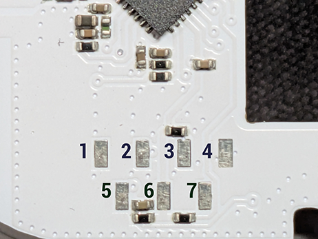

<!-- Improved compatibility of back to top link: See: https://github.com/othneildrew/Best-README-Template/pull/73 -->
<a id="readme-top"></a>
<!--
*** Thanks for checking out the Best-README-Template. If you have a suggestion
*** that would make this better, please fork the repo and create a pull request
*** or simply open an issue with the tag "enhancement".
*** Don't forget to give the project a star!
*** Thanks again! Now go create something AMAZING! :D
-->


<!-- PROJECT SHIELDS -->
<!--
*** I'm using markdown "reference style" links for readability.
*** Reference links are enclosed in brackets [ ] instead of parentheses ( ).
*** See the bottom of this document for the declaration of the reference variables
*** for contributors-url, forks-url, etc. This is an optional, concise syntax you may use.
*** https://www.markdownguide.org/basic-syntax/#reference-style-links
-->
[![Contributors][contributors-shield]][contributors-url]
[![Forks][forks-shield]][forks-url]
[![Stargazers][stars-shield]][stars-url]
[![Issues][issues-shield]][issues-url]
[![project_license][license-shield]][license-url]
<br />
<h1 align="center">Shelly H&T Gen3 <sup>WIP</sup></h1>

Battery-powered WiFi temperature/humidity sensor with a segment E-Paper display (UC8119 controller). Uses an ESP32-C3 with 8MB flash, a Sensirion SHT31 sensor, and a UltraChip UC8119 E-Paper segment display with 91 active segments (10 digits + 13 icons).

Requires a custom ESPHome external component for the UC8119 display — the first open-source driver for this chip.

## Components

| Component | Part | Interface | Address |
|-----------|------|-----------|---------|
| MCU | ESP32-C3 | — | — |
| Temp/Humi Sensor | Sensirion SHT31 | I2C | 0x44 |
| Display Controller | UltraChip UC8119 | I2C | 0x50 |
| Flash | 8MB SPI | — | — |


### GPIO Pinout

| GPIO   | Function         | Notes                                       |
|--------|------------------|---------------------------------------------|
| GPIO0  | Button           | XTAL_32K_P, external pull-up,             |
| GPIO1  | I2C SDA          | Shared bus (SHT31 + UC8119), external pull-up         |
| GPIO3  | I2C SCL          | 100kHz, pull-up                              |
| GPIO2 | Battery ADC      | Via voltage divider (4x AA LR6)              |
| GPIO6  | UC8119 BUSY_N    | LOW=busy, external pull-up             |
| GPIO7  | UC8119 RESET_N   | Active LOW                                   |
| GPIO10 | UC8119 Enable    | Display power gate, HIGH=on                  |


## Serial Pinout (Debug Header)



| Pad | Function |
|-----|----------|
| 1   | NC       |
| 2   | RXD      |
| 3   | CHIP_EN  |
| 4   | GND      |
| 5   | TXD      |
| 6   | VCC 3V3  |
| 7   | BOOT / GPIO9 |

### Flashing

> **Note:** OTA flashing from the original Shelly firmware is **not possible**.
> Shelly Gen4 verifies OTA images with an ECDSA signature using their private key.
> The device must be flashed via UART.

To enter download mode, hold **IO9** low (connect to GND) while powering on the device. Release after boot.

### Backup the original firmware

Always back up the original firmware before flashing:

```bash
esptool.py --chip esp32c3 --port /dev/ttyUSB0 --baud 460800 \
  --before no-reset --after no-reset \
  read_flash 0 0x800000 shelly-ht-gen3-backup.bin
```

### Compile

```bash
esphome compile shelly-ht-gen3.yaml
```

The factory binary is located at:

`.esphome/build/shelly-ht-gen3/.pioenvs/shelly-ht-gen3/firmware-factory.bin`

### Flash

```bash
esptool.py --chip esp32c3 --port /dev/ttyUSB0 --baud 460800 \
  write_flash 0x0 firmware-factory.bin
```

# Display Segment Layout

91 active segments: 4 clock digits (T1-T4), 3 temperature digits (D1-D3) with decimal point, 2 humidity digits (H1-H2), 1 unit digit (C/F), and 13 icons (battery bars, signal bars, Bluetooth, globe/WiFi, frost, heating, ventilator, calendar, arrow, colon, degree, percent).


## Notes
- The display layer reads sensor values from RAM (no I2C), so sensor reads and display writes never collide on the shared I2C bus.
- Button actions: short press = force refresh, double click = ghost clear, long press (3s) = reboot.
- Font selection: `siekoo` (default, confusion-free) or `classic` (traditional 7-segment).

<!-- LICENSE -->
## License


<p align="right">(<a href="#readme-top">back to top</a>)</p>


<!-- MARKDOWN LINKS & IMAGES -->
<!-- https://www.markdownguide.org/basic-syntax/#reference-style-links -->
[wip-shield]: https://img.shields.io/github/contributors/oxynatOr/esphome-shelly_ht_gen3.svg?style=for-the-badge
[contributors-shield]: https://img.shields.io/github/contributors/oxynatOr/esphome-shelly_ht_gen3.svg?style=for-the-badge
[contributors-url]: https://github.com/oxynatOr/esphome-shelly_ht_gen3/graphs/contributors
[forks-shield]: https://img.shields.io/github/forks/oxynatOr/esphome-shelly_ht_gen3.svg?style=for-the-badge
[forks-url]: https://github.com/oxynatOr/esphome-shelly_ht_gen3/network/members
[stars-shield]: https://img.shields.io/github/stars/oxynatOr/esphome-shelly_ht_gen3.svg?style=for-the-badge
[stars-url]: https://github.com/oxynatOr/esphome-shelly_ht_gen3/stargazers
[issues-shield]: https://img.shields.io/github/issues/oxynatOr/esphome-shelly_ht_gen3.svg?style=for-the-badge
[issues-url]: https://github.com/oxynatOr/esphome-shelly_ht_gen3/issues
[license-shield]: https://img.shields.io/github/license/oxynatOr/esphome-shelly_ht_gen3.svg?style=for-the-badge
[license-url]: https://github.com/oxynatOr/esphome-shelly_ht_gen3/blob/main/LICENSE
[Next.js]: https://img.shields.io/badge/next.js-000000?style=for-the-badge&logo=nextdotjs&logoColor=white
[Next-url]: https://nextjs.org/
[React.js]: https://img.shields.io/badge/React-20232A?style=for-the-badge&logo=react&logoColor=61DAFB
[React-url]: https://reactjs.org/
[Vue.js]: https://img.shields.io/badge/Vue.js-35495E?style=for-the-badge&logo=vuedotjs&logoColor=4FC08D
[Vue-url]: https://vuejs.org/
[Angular.io]: https://img.shields.io/badge/Angular-DD0031?style=for-the-badge&logo=angular&logoColor=white
[Angular-url]: https://angular.io/
[Svelte.dev]: https://img.shields.io/badge/Svelte-4A4A55?style=for-the-badge&logo=svelte&logoColor=FF3E00
[Svelte-url]: https://svelte.dev/
[Laravel.com]: https://img.shields.io/badge/Laravel-FF2D20?style=for-the-badge&logo=laravel&logoColor=white
[Laravel-url]: https://laravel.com
[Bootstrap.com]: https://img.shields.io/badge/Bootstrap-563D7C?style=for-the-badge&logo=bootstrap&logoColor=white
[Bootstrap-url]: https://getbootstrap.com
[JQuery.com]: https://img.shields.io/badge/jQuery-0769AD?style=for-the-badge&logo=jquery&logoColor=white
[JQuery-url]: https://jquery.com 
