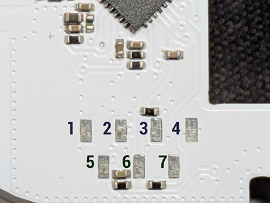

<!-- Improved compatibility of back to top link -->
<a id="readme-top"></a>

<!-- PROJECT SHIELDS -->
<div align="center">

[![Contributors][contributors-shield]][contributors-url]
[![Forks][forks-shield]][forks-url]
[![Stargazers][stars-shield]][stars-url]
[![Issues][issues-shield]][issues-url]
[![License][license-shield]][license-url]

</div>

<!-- PROJECT TITLE -->
<br />

<h1>🔋 Shelly H&amp;T Gen3 — ESPHome Component</h1>

**Custom ESPHome driver for the Shelly H&amp;T Gen3** — featuring the first open-source **UC8119 segment E-Paper driver**.

Battery-powered WiFi temperature & humidity sensor with a segment E-Paper display (UC8119 controller). Uses an ESP32-C3 with 8 MB flash, a Sensirion SHT31 sensor, and an UltraChip UC8119 E-Paper segment display with 91 active segments (10 digits + 13 icons).

> 🚀 **Why this matters:** This is the **first open-source driver** for the UC8119 chip. If you're reverse-engineering a similar e-paper segment display, this project is a solid reference.

---

## ✨ Features

- 🌡️ **SHT31 Sensor** — High-accuracy temperature & humidity via I2C
- 🖥️ **UC8119 Driver** — First open-source driver for this E-Paper segment controller
- 🔤 **Siekoo Font** — Confusion-free 7-segment alphabet (0/O, 1/I, 5/S, 2/Z distinct)
- ⚡ **Deep Sleep** — Optimized for battery operation
- 🔋 **Battery Monitoring** — Voltage divider ADC + presence detection
- 🎛️ **Button Actions** — Short press = refresh · Double = ghost clear · Long (3s) = reboot
- 🎨 **3 Font Options** — `siekoo`, `seg7alpha`, `classic`

---

## 🧩 Components

| Component | Part | Interface | Address | Notes |
|:----------|:-----|:---------:|:-------:|:------|
| MCU | ESP32-C3 | — | — | Main controller |
| Temp / Humidity | Sensirion SHT31 | I2C | `0x44` | High-accuracy sensor |
| Display Controller | UltraChip UC8119 | I2C | `0x50` | Segment E-Paper driver |
| Flash | 8 MB SPI | SPI0 | — | Firmware storage |

---

## 🔌 Hardware (Shelly H&amp;T Gen3)

### 📍 GPIO Mapping

| Function | GPIO | Notes |
|:---------|:----:|:------|
| SDA | GPIO1 | I2C data, external pull-up |
| SCL | GPIO3 | I2C clock, external pull-up |
| RESET_N | GPIO7 | Active LOW, 10 ms pulse |
| BUSY_N | GPIO6 | LOW = busy, external pull-up |
| Enable | GPIO10 | Display power gate, HIGH = on |
| Button | GPIO0 | XTAL_32K_P, pull-up |
| Battery ADC | GPIO4 | Via voltage divider |
| Battery presence | GPIO5 | HIGH when battery connected |
| Battery power enable | GPIO18 | Enables power-path for battery |
| Power Rail ADC | GPIO2 | Via voltage divider |

### 🔌 I2C Devices

| Device | Address | Notes |
|:-------|:-------:|:------|
| SHT31 | `0x44` | Temperature + humidity sensor |
| UC8119 | `0x50` | Segment EPD controller |

### 🔧 Serial Pinout (Debug Header)



| Pad | Function |
|:---:|:---------|
| 1 | Not Found |
| 2 | RXD |
| 3 | CHIP_EN |
| 4 | GND |
| 5 | TXD |
| 6 | VCC 3V3 |
| 7 | BOOT / GPIO9 |

#### OTA from the Shelly stock firmware

Flashing over the air is possible with the [**ShellyOTA**](https://github.com/oxynatOr/free-shelly-ota) script.

- Tested against stock firmware **2.0.1**.
- The **battery must be at least 35 %**, otherwise the update is refused.
- The build must use the stock partition table so the image fits the layout on the device. Copy [`docu/csv/HTG3-stock.csv`](docu/csv/HTG3-stock.csv) next to your YAML and set:

```yaml
esp32:
  board: esp32-c3-devkitm-1
  variant: ESP32C3
  flash_size: 8MB
  partitions: csv/HTG3-stock.csv
  framework:
    type: esp-idf
    version: recommended
    sdkconfig_options:
      CONFIG_PARTITION_TABLE_OFFSET: "0xf000"
```

The partition table is at `0xf000` on this device (Plug M Gen3: `0x10000`). The table in flash stays Shelly's; the CSV only makes ESPHome build against the same layout.

#### Flashing via UART

## 🚀 Flashing

> [!WARNING]
> **OTA flashing from original Shelly firmware is NOT possible.**
> Shelly Gen3+ (Firmware v1.7+) verifies OTA images with an **ECDSA signature** using their private key.
> ➡️ The device **must be flashed via UART**.

### 🔑 Entering Download Mode

To enter download mode, hold **IO9 low** (connect to GND) while powering on the device. Release after boot.

<details>
<summary><b>💾 1. Backup the Original Firmware</b> — always do this first!</summary>
<br>

```bash
esptool.py --chip esp32c3 --port /dev/ttyUSB0 --baud 460800 \
  --before no-reset --after no-reset \
  read_flash 0 0x800000 shelly-ht-gen3-backup.bin
```

</details>

<details>
<summary><b>🔨 2. Compile</b></summary>
<br>

```bash
esphome compile shelly-ht-gen3.yaml
```

The factory binary is located at:

```
.esphome/build/shelly-ht-gen3/.pioenvs/shelly-ht-gen3/firmware-factory.bin
```

</details>

<details>
<summary><b>⚡ 3. Flash</b></summary>
<br>

```bash
esptool.py --chip esp32c3 --port /dev/ttyUSB0 --baud 460800 \
  write_flash 0x0 firmware-factory.bin
```

</details>

---

## 🖥️ Display Segment Layout

The UC8119 drives **91 active segments**:

- 🕐 **Clock** — T1–T4: 4 digits (HH:MM)
- 🌡️ **Temperature** — D1–D3: 3 digits + decimal point
- 💧 **Humidity** — H1–H2: 2 digits
- 🌡️ **Unit** — 1 digit: °C / °F
- 🎨 **Icons** — 13 icons: battery, signal, BT, WiFi, frost, heating, fan, calendar, arrow, colon, degree, percent

<details>
<summary><b>📊 Full Digit-to-Bit Mapping</b> — click to expand</summary>
<br>

| Digit | Function | A | B | C | D | E | F | G |
|:------|:---------|:--:|:--:|:--:|:--:|:--:|:--:|:--:|
| T1 | Clock tens hour | 12 | 26 | 32 | 28 | 19 | 17 | 29 |
| T2 | Clock ones hour | 13 | 23 | 35 | 37 | 36 | 24 | 34 |
| T3 | Clock tens min | 14 | 18 | 44 | 131 | 40 | 22 | 39 |
| T4 | Clock ones min | 8 | 7 | 9 | 11 | 30 | 15 | 10 |
| D1 | Temp tens | 41 | 129 | 128 | 43 | 21 | 20 | 42 |
| D2 | Temp ones | 95 | 91 | 92 | 94 | 96 | 127 | 93 |
| D3 | Temp decimal | 89 | 85 | 51 | 87 | 88 | 90 | 86 |
| H1 | Humidity tens | 55 | 58 | 61 | 62 | 60 | 57 | 59 |
| H2 | Humidity ones | 74 | 76 | 75 | 72 | 71 | 56 | 73 |
| UNIT | Temp unit (°C/°F) | 53 | 79 | 84 | 81 | 77 | 54 | 78 |

> [!NOTE]
> - **D2-F** (Bit 127) is in Byte 15 — far from other D2 segments (Bytes 11–12)
> - **T3-D** (Bit 131) and **D1-B** (Bit 129) are also in the upper byte range

</details>

<details>
<summary><b>🎨 Icons &amp; Special Segments</b> — click to expand</summary>
<br>

| Segment | Bit | Description |
|:--------|:---:|:------------|
| `BATT_5` | 0 | Battery frame (always on when battery shown) |
| `BATT_4` | 1 | Battery bar 4 |
| `BATT_3` | 2 | Battery bar 3 |
| `BATT_2` | 3 | Battery bar 2 |
| `BATT_1` | 4 | Battery bar 1 (lowest) |
| `PFEIL` | 5 | Arrow / triangle icon |
| `SIG_1` | 6 | Signal bar 1 (smallest) |
| `SIG_2` | 16 | Signal bar 2 |
| `SIG_3` | 25 | Signal bar 3 |
| `SIG_4` | 33 | Signal bar 4 (largest) |
| `FROST` | 27 | Snowflake icon |
| `COLON` | 38 | Clock colon (both dots) |
| `BT` | 45 | Bluetooth icon |
| `GLOBE` | 46 | Globe / WiFi icon |
| `HEIZ` | 47 | Heating (waves) icon |
| `VENT` | 48 | Ventilator / fan icon |
| `KALEN` | 49 | Calendar icon |
| `DP` | 50 | Decimal point (between D2 and D3) |
| `GRAD` | 52 | Degree symbol (°) |
| `PROZENT` | 83 | Percent symbol (%) |
| `COL_MID` | 130 | Middle colon dot *(unused — creates unwanted 3rd dot)* |

</details>

<details>
<summary><b>🚫 Unused Bits</b> — click to expand</summary>
<br>

**45 bits** are not connected to visible segments — mostly in **Bytes 8** and **12–15**.

These are reserved/unused COM/SEG lines in the UC8119 that have no corresponding LCD segment on this panel.

</details>

---

## 📝 Notes

- 🧠 **Shared I2C bus:** The display layer reads sensor values from **RAM** (no I2C), so sensor reads and display writes never collide.
- 🎛️ **Button actions:**
  - **Short press** → force refresh
  - **Double click** → ghost clear
  - **Long press (3s)** → reboot
  - In Deep-Sleep → acts as **Wake-Up button**
- 🔤 **Font selection:** `siekoo` *(default, confusion-free)* · `seg7alpha` *(AI-generated, confusion-free)* · `classic` *(traditional 7-segment)*

### 🎨 About the Siekoo Font

The **Siekoo 7-segment alphabet** was created by [Alexander Fakoó](https://fakoo.de/). It provides a **confusion-free** character set where every letter is visually distinct from every digit — no more mixing up `0/O`, `1/I`, `5/S`, or `2/Z`.

> **🙏 Special Thanks to Alexander Fakoó**
>
> Alexander graciously agreed to release the Siekoo alphabet under the MIT license for use in this project.
>
> *Thank you for your work and your openness to the open-source community!* 💚

---

## 📄 License

**MIT** for all code (driver, display layer, examples, tools).

See [`LICENSE`][license-url] for details.

<p align="right">(<a href="#readme-top">⬆️ back to top</a>)</p>

---

<!-- MARKDOWN LINKS & IMAGES -->
[contributors-shield]: https://img.shields.io/github/contributors/oxynatOr/esphome-shelly_ht_gen3.svg?style=for-the-badge
[contributors-url]: https://github.com/oxynatOr/esphome-shelly_ht_gen3/graphs/contributors
[forks-shield]: https://img.shields.io/github/forks/oxynatOr/esphome-shelly_ht_gen3.svg?style=for-the-badge
[forks-url]: https://github.com/oxynatOr/esphome-shelly_ht_gen3/network/members
[stars-shield]: https://img.shields.io/github/stars/oxynatOr/esphome-shelly_ht_gen3.svg?style=for-the-badge
[stars-url]: https://github.com/oxynatOr/esphome-shelly_ht_gen3/stargazers
[issues-shield]: https://img.shields.io/github/issues/oxynatOr/esphome-shelly_ht_gen3.svg?style=for-the-badge
[issues-url]: https://github.com/oxynatOr/esphome-shelly_ht_gen3/issues
[license-shield]: https://img.shields.io/github/license/oxynatOr/esphome-shelly_ht_gen3.svg?style=for-the-badge
[license-url]: https://github.com/oxynatOr/esphome-shelly_ht_gen3/blob/main/LICENSE
